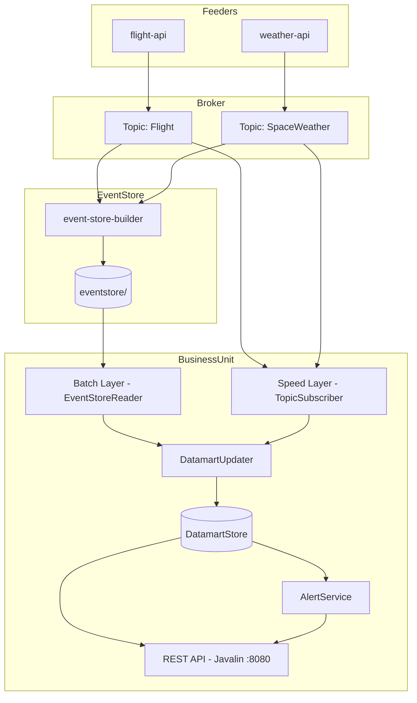
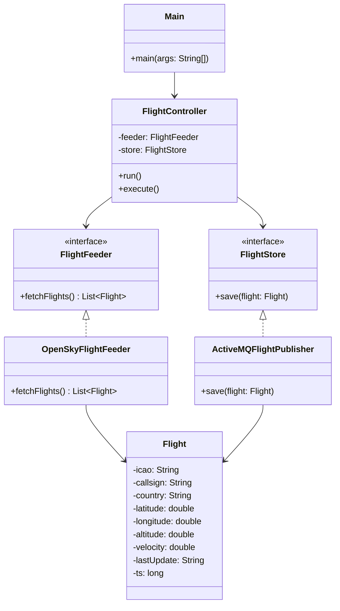
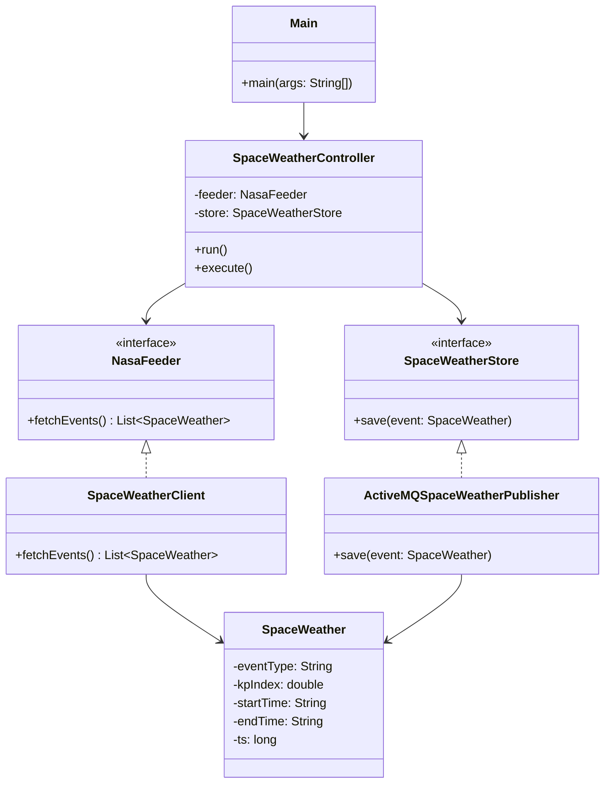
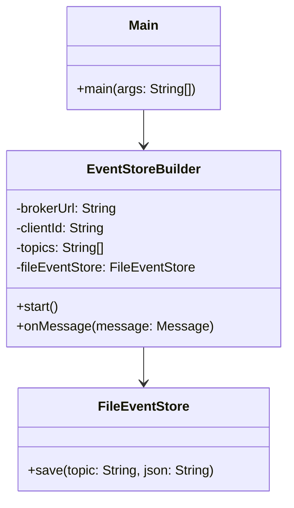
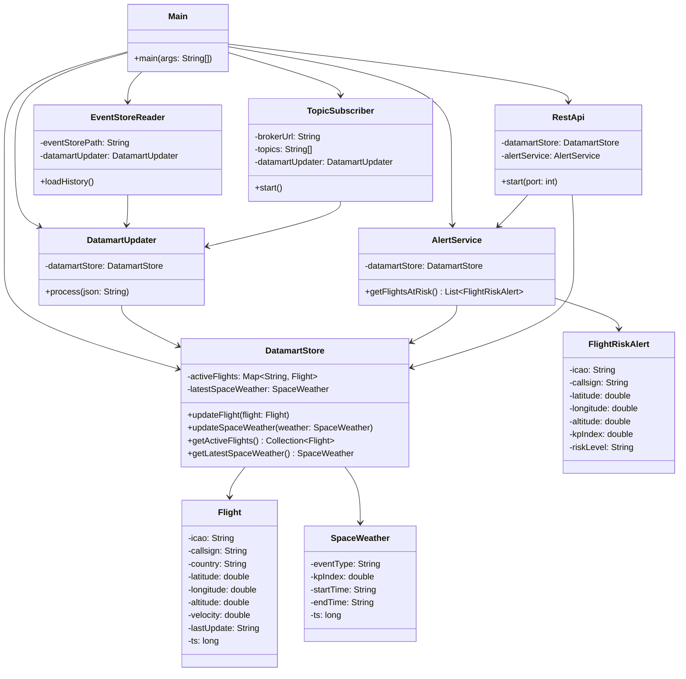

# Space Weather & Aviation Analysis — Sprint 3

## Contexto

Proyecto que analiza el impacto del **clima espacial** en la **aviación comercial**, especialmente en rutas transpolares. Se capturan datos geomagnéticos (NASA DONKI API) y vuelos en tiempo real (OpenSky API), publicándolos en un broker de mensajería (ActiveMQ), almacenándolos en un Event Store basado en ficheros, y explotándolos mediante una unidad de negocio con arquitectura Lambda.

> Sprint 3: implementación del módulo `business-unit` con arquitectura Lambda (Batch Layer + Speed Layer), datamart en memoria y API REST con Javalin.

---

## Objetivo de la funcionalidad de negocio

El módulo `business-unit` detecta **vuelos comerciales en riesgo geomagnético**. Cuando el índice Kp supera un umbral crítico (≥ 5.0) y hay vuelos activos en latitudes polares (> 60° o < -60°), el sistema emite alertas de riesgo en tiempo real.

Esto aporta valor a operadores de aviación que gestionan rutas transpolares, ya que las tormentas geomagnéticas pueden afectar las comunicaciones y los sistemas de navegación en esas rutas.

---

## Módulos

| Módulo | Responsabilidad |
|---|---|
| `flight-api` | Captura vuelos en tiempo real desde OpenSky Network y los publica en ActiveMQ |
| `weather-api` | Captura índices Kp desde NASA DONKI y los publica en ActiveMQ |
| `event-store-builder` | Se suscribe a los topics y persiste los eventos en un Event Store basado en ficheros |
| `business-unit` | Construye y mantiene un datamart en memoria con arquitectura Lambda y expone una API REST |

---

## Arquitectura

### Diagrama general del sistema



### Diagrama de clases — `flight-api`



### Diagrama de clases — `weather-api`



### Diagrama de clases — `event-store-builder`



### Diagrama de clases — `business-unit`



---

## Diseño del Datamart

El datamart está implementado en memoria mediante `DatamartStore`, usando estructuras optimizadas para consultas en tiempo real:

- `ConcurrentHashMap<String, Flight>` — indexado por ICAO, permite acceso O(1) por vuelo y actualizaciones concurrentes seguras desde la Speed Layer
- `SpaceWeather latestSpaceWeather` — solo se necesita el último índice Kp para evaluar el riesgo actual

**Justificación:** el caso de uso es detección de riesgo en tiempo real, no análisis histórico profundo. La estructura en memoria es suficiente y óptima para consultas de baja latencia. Al arrancar, la Batch Layer reconstruye el estado inicial leyendo el Event Store histórico, garantizando coherencia aunque el sistema se reinicie.

---

## Event Store

Los eventos se almacenan en la siguiente estructura de directorios:

```text
eventstore/
└── {topic}/
    └── {source}/
        └── {YYYYMMDD}.events
```

Ejemplo:

```text
eventstore/
├── Flight/
│   └── flight-api/
│       └── 20260427.events
└── SpaceWeather/
    └── weather-api/
        └── 20260427.events
```

Cada línea de un fichero `.events` representa un evento JSON con al menos los campos:

- `ts` → timestamp del evento
- `ss` → identificador del sistema origen

---

## Compilar y ejecutar

### Prerrequisitos

1. Java 21
2. Maven
3. ActiveMQ 6.2.4 en ejecución en `tcp://localhost:61616`

### 1. Compilar el proyecto completo

```bash
mvn install
```

### 2. Arrancar ActiveMQ

```bash
cd apache-activemq-6.2.4/bin
./activemq start        # Linux/Mac
activemq.bat start      # Windows
```

### 3. Ejecutar el Event Store Builder

```bash
cd event-store-builder
mvn exec:java -Dexec.mainClass="org.ulpgc.dacd.Main" -Dexec.args="tcp://localhost:61616 ./eventstore Flight,SpaceWeather"
```

### 4. Ejecutar el feeder de vuelos

```bash
cd flight-api
mvn exec:java -Dexec.mainClass="org.ulpgc.dacd.Main"
```

### 5. Ejecutar el feeder de clima espacial

```bash
cd weather-api
mvn exec:java -Dexec.mainClass="org.ulpgc.dacd.Main"
```

### 6. Ejecutar la Business Unit

```bash
cd business-unit
mvn exec:java -Dexec.mainClass="org.ulpgc.dacd.Main" -Dexec.args="tcp://localhost:61616 ./eventstore"
```

---

## API REST — Endpoints

Una vez arrancado el módulo `business-unit`, la API queda disponible en `http://localhost:8080`.

| Método | Endpoint | Descripción |
|--------|----------|-------------|
| GET | `/flights` | Lista todos los vuelos activos en el datamart |
| GET | `/weather` | Último índice Kp registrado |
| GET | `/alerts` | Vuelos en riesgo geomagnético (Kp ≥ 5.0 y latitud polar) |

### Ejemplo de respuesta `/alerts`

```json
[
  {
    "icao": "A1B2C3",
    "callsign": "BAW123",
    "latitude": 72.4,
    "longitude": -45.2,
    "altitude": 11000.0,
    "kpIndex": 6.3,
    "riskLevel": "HIGH"
  }
]
```

---

## Tecnologías

- Java 21
- Maven (multimódulo)
- ActiveMQ 6.2.4
- Gson
- Javalin 6.3.0
- OpenSky Network API
- NASA DONKI API

---

## Autores

Adrián Santana Rosales  
Nira Armas Maestre
