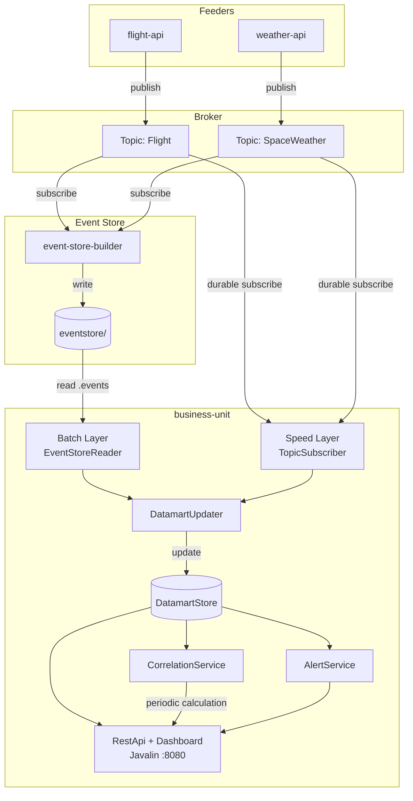
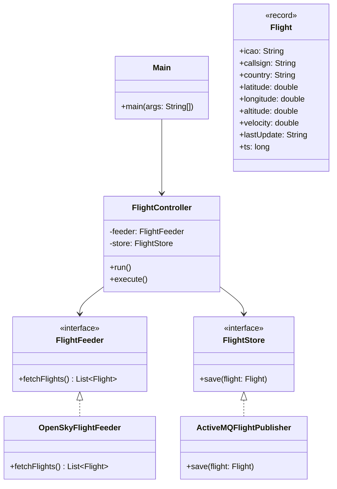
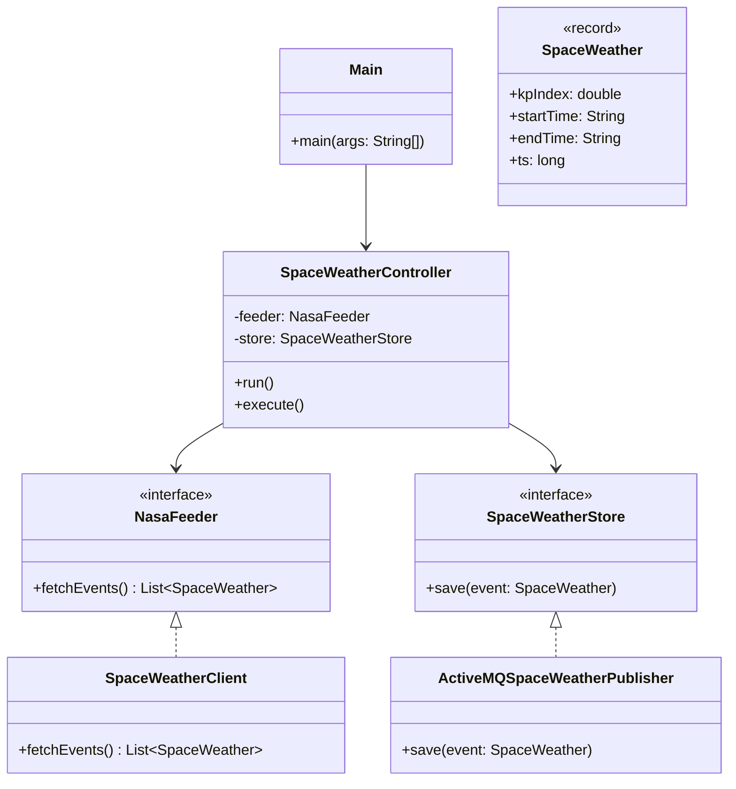
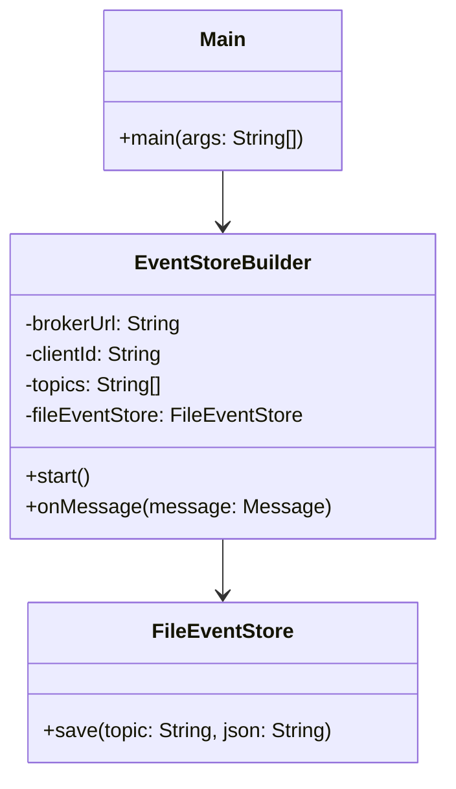
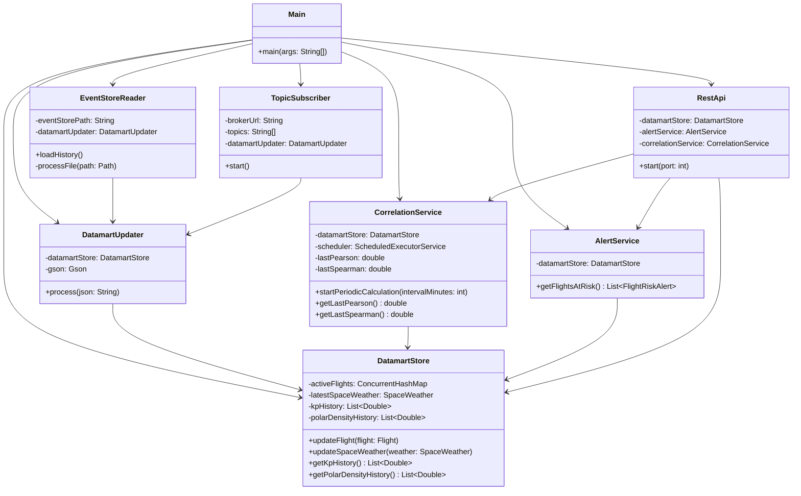

# SkyWatch — Space Weather & Aviation Analysis

## Descripción del proyecto

SkyWatch es un sistema que analiza en tiempo real el impacto del **clima espacial** en la **aviación comercial**, especialmente en rutas transpolares. Cuando se producen tormentas geomagnéticas (medidas por el índice Kp), los sistemas de comunicación y navegación de los aviones que vuelan en latitudes polares pueden verse afectados.

El sistema captura datos geomagnéticos desde la API de NOAA SWPC y datos de vuelos en tiempo real desde OpenSky Network, los publica en un broker de mensajería (ActiveMQ), los persiste en un Event Store basado en ficheros y los explota mediante una unidad de negocio con arquitectura Lambda que ofrece un **dashboard interactivo con mapa de calor** y **análisis de correlación estadística** (Pearson y Spearman).

## Propuesta de valor

SkyWatch aporta valor a **operadores de aviación y controladores de tráfico aéreo** que gestionan rutas transpolares:

- **Detección de riesgo en tiempo real**: identifica vuelos activos en zonas polares (latitud > 60°) cuando el índice Kp supera niveles de tormenta geomagnética (≥ 5.0).
- **Análisis de correlación estadística**: calcula periódicamente los coeficientes de Pearson y Spearman entre el índice Kp y la densidad de vuelos polares, permitiendo validar cuantitativamente si las tormentas solares afectan al tráfico aéreo.
- **Dashboard visual**: mapa de calor interactivo que muestra las zonas de mayor riesgo geomagnético combinando la posición de los vuelos con la intensidad de la actividad solar.
## Justificación de las APIs elegidas

| API | Justificación |
|-----|---------------|
| **NOAA SWPC** (Space Weather) | Proporciona el índice Kp en tiempo real desde el Space Weather Prediction Center. Es gratuita, no requiere autenticación y devuelve datos JSON actualizados cada minuto (`planetary_k_index_1m.json`). El índice Kp es la medida estándar de actividad geomagnética usada internacionalmente para clasificar tormentas solares (G1-G5). |
| **OpenSky Network** (Aviation) | Ofrece datos ADS-B de vuelos en tiempo real a nivel mundial: posición, altitud, velocidad e identificación. Es gratuita, con API REST abierta y cobertura global. |

La combinación de ambas fuentes permite correlacionar fenómenos solares con tráfico aéreo real, algo que no ofrecen individualmente.
 
---

## Módulos

| Módulo | Responsabilidad |
|--------|----------------|
| `flight-api` | Captura vuelos desde OpenSky Network y los publica en ActiveMQ (topic `Flight`) |
| `weather-api` | Captura índices Kp desde NOAA SWPC y los publica en ActiveMQ (topic `SpaceWeather`) |
| `event-store-builder` | Se suscribe a los topics y persiste los eventos en ficheros `.events` (Event Store) |
| `business-unit` | Arquitectura Lambda: reconstruye estado desde histórico, consume eventos en tiempo real, calcula correlaciones y sirve dashboard con API REST |
 
---

## Arquitectura del sistema



### Arquitectura Lambda

El módulo `business-unit` implementa una arquitectura Lambda con dos capas:

- **Batch Layer** (`EventStoreReader`): al arrancar, lee todos los ficheros `.events` históricos del Event Store, los procesa cronológicamente y reconstruye el estado del datamart. Esto permite que el sistema se reinicie sin perder datos.
- **Speed Layer** (`TopicSubscriber`): una vez cargado el histórico, se suscribe de forma durable a los topics de ActiveMQ para consumir eventos en tiempo real y mantener el datamart actualizado.
  Ambas capas alimentan el mismo `DatamartUpdater`, que actúa como punto de entrada unificado al datamart.

---

## Diagrama de clases — `flight-api`



**Principios aplicados**: SRP (cada clase una responsabilidad), DIP (depende de interfaces `FlightFeeder` y `FlightStore`, no de implementaciones concretas), OCP (se pueden añadir nuevos stores implementando la interfaz sin modificar código existente).

## Diagrama de clases — `weather-api`



**Principios aplicados**: misma arquitectura que `flight-api` — DIP mediante interfaces, SRP, OCP.

## Diagrama de clases — `event-store-builder`



**Principios aplicados**: SRP (persistencia delegada a `FileEventStore`), patrón Observer (listener de mensajes JMS).

## Diagrama de clases — `business-unit`



**Principios aplicados**:
- **SRP**: cada clase tiene una responsabilidad única — `EventStoreReader` lee histórico, `TopicSubscriber` consume tiempo real, `DatamartUpdater` procesa JSON, `DatamartStore` almacena estado, `CorrelationService` calcula estadísticos, `AlertService` evalúa riesgo, `RestApi` sirve la interfaz.
- **CQRS**: separación entre escritura (feeders → broker → datamart) y lectura (REST API → datamart).
- **Observer**: `TopicSubscriber` actúa como listener JMS de los eventos publicados por los feeders.
- **Arquitectura Lambda**: `EventStoreReader` (batch) + `TopicSubscriber` (speed) alimentan el mismo datamart.
---

## Estructura del Datamart

El datamart está implementado en memoria dentro de `DatamartStore`, optimizado para consultas en tiempo real:

| Estructura | Tipo | Propósito |
|-----------|------|-----------|
| `activeFlights` | `ConcurrentHashMap<String, Flight>` | Vuelos activos indexados por ICAO — acceso O(1), thread-safe |
| `latestSpaceWeather` | `SpaceWeather` | Último índice Kp recibido |
| `kpHistory` | `CopyOnWriteArrayList<Double>` | Serie temporal de valores Kp — para correlación |
| `polarDensityHistory` | `CopyOnWriteArrayList<Double>` | Serie temporal de densidad de vuelos polares — para correlación |

**Justificación**: el caso de uso principal es detección de riesgo en tiempo real y cálculo de correlación estadística. La estructura en memoria permite consultas de baja latencia. Las listas `CopyOnWriteArrayList` son thread-safe para escritura concurrente desde la Speed Layer. Al arrancar, la Batch Layer reconstruye el estado completo leyendo el Event Store.

Los estadísticos de correlación (Pearson y Spearman) se precalculan periódicamente (cada 5 minutos) mediante `CorrelationService` y se almacenan como resultados listos para consumir — el datamart sirve datos ya procesados, no datos crudos.
 
---

## Event Store

Los eventos se almacenan en la siguiente estructura de directorios:

```
eventstore/
└── {topic}/
    └── {source}/
        └── {YYYYMMDD}.events
```

Ejemplo:

```
eventstore/
├── Flight/
│   └── flight-api/
│       ├── 20260427.events
│       └── 20260506.events
└── SpaceWeather/
    └── weather-api/
        ├── 20260427.events
        └── 20260506.events
```

Cada línea de un fichero `.events` es un evento JSON con al menos:
- `ts` — timestamp del evento (epoch millis)
- `ss` — identificador del sistema origen
---

## Compilar y ejecutar

### Prerrequisitos

- Java 21
- Maven
- Apache ActiveMQ 6.2.4
### 1. Compilar el proyecto completo

```bash
mvn clean install
```

### 2. Arrancar ActiveMQ

```bash
cd apache-activemq-6.2.4/bin
./activemq start        # Linux/Mac
activemq.bat start      # Windows
```

Consola de administración disponible en `http://localhost:8161` (usuario: admin, contraseña: admin).

### 3. Ejecutar el Event Store Builder

```bash
cd event-store-builder
mvn exec:java "-Dexec.mainClass=org.ulpgc.dacd.Main" "-Dexec.args=tcp://localhost:61616 ./eventstore Flight,SpaceWeather"
```

### 4. Ejecutar el feeder de vuelos

```bash
cd flight-api
mvn exec:java "-Dexec.mainClass=org.ulpgc.dacd.Main"
```

### 5. Ejecutar el feeder de clima espacial

```bash
cd weather-api
mvn exec:java "-Dexec.mainClass=org.ulpgc.dacd.Main"
```

### 6. Ejecutar la Business Unit

```bash
cd business-unit
mvn exec:java "-Dexec.mainClass=org.ulpgc.dacd.Main" "-Dexec.args=tcp://localhost:61616 ./eventstore"
```

> **Nota**: si la ruta del eventstore contiene espacios, encerrarla entre comillas: `"C:\ruta con espacios\eventstore"`
 
---

## Interfaz de usuario

Una vez arrancado el módulo `business-unit`, la interfaz está disponible en `http://localhost:8080`.

### Dashboard (mapa de calor)

Accesible en `http://localhost:8080` o `http://localhost:8080/dashboard.html`.

Muestra en tiempo real:
- Mapa de calor con las posiciones de los vuelos, coloreado según el riesgo geomagnético (combinación de latitud polar + índice Kp).
- Panel lateral con índice Kp actual, nivel de tormenta, coeficientes de correlación Pearson y Spearman, número de muestras, estadísticas de vuelos y alertas activas.
- Auto-refresco cada 30 segundos.
### API REST

| Método | Endpoint | Descripción | Ejemplo de respuesta |
|--------|----------|-------------|---------------------|
| GET | `/flights` | Vuelos activos en el datamart | `[{"icao":"A5F852","callsign":"RTY484","latitude":40.45,...}]` |
| GET | `/weather` | Último índice Kp registrado | `{"kpIndex":2.3,"startTime":"2026-05-18T12:00Z",...}` |
| GET | `/alerts` | Vuelos en riesgo geomagnético | `[{"icao":"A1B2C3","callsign":"BAW123","riskLevel":"HIGH",...}]` |
| GET | `/correlation` | Estadísticos de correlación precalculados | `{"pearson":0.0,"spearman":0.5087,"samples":3902,...}` |

### Ejemplo de consulta con curl

```bash
curl http://localhost:8080/correlation
```

Respuesta:

```json
{
  "pearson": 0.0,
  "spearman": 0.5087,
  "samples": 3902,
  "interpretation": "Weak or no correlation"
}
```
 
---

## Tecnologías

- Java 21
- Maven (multimódulo)
- Apache ActiveMQ 6.2.4 (`jakarta.jms.*`)
- Gson 2.10.1
- Javalin 6.3.0
- Leaflet.js 1.9.4 + Leaflet.heat (mapa de calor)
- OpenSky Network API
- NOAA SWPC API
---

## Trabajo futuro

- **Predictor con scikit-learn**: entrenar un modelo de regresión en Python que, dado un Kp futuro, prediga la densidad de vuelos polares afectados. Java invocaría el script mediante `ProcessBuilder` y expondría la predicción en un endpoint `/predict`.
- **Persistencia del datamart**: migrar de memoria a SQLite para mantener el historial entre reinicios sin depender del Event Store.
- **Alertas push**: notificaciones en tiempo real mediante WebSockets cuando el Kp supere el umbral crítico.
---

## Autores

Adrián Santana Rosales

Nira Armas Maestre